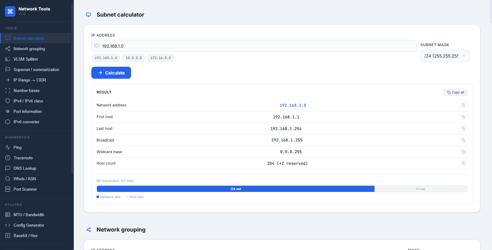
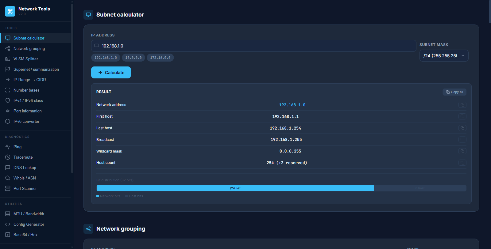
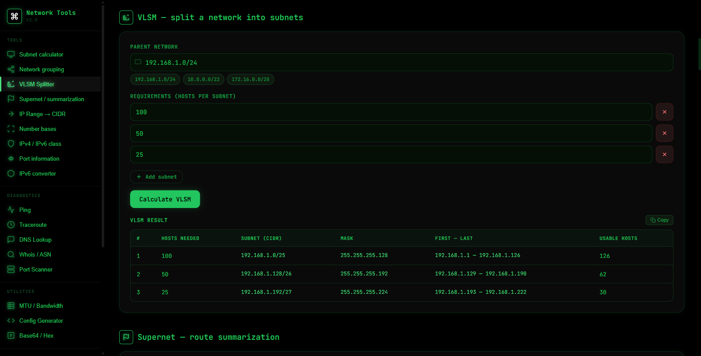
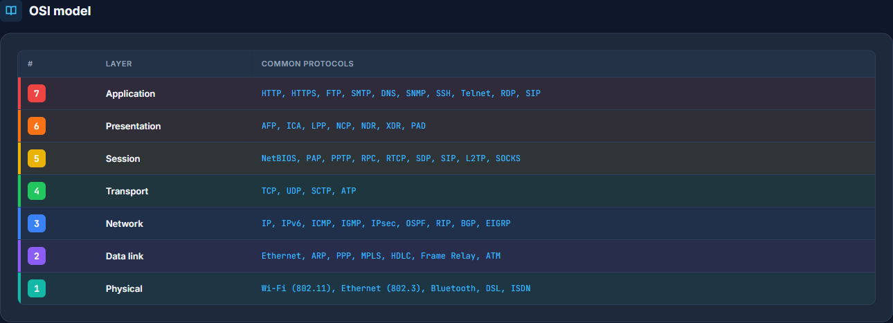

# Network Tools

[](https://www.python.org/)
[](https://fastapi.tiangolo.com/)
[](https://www.docker.com/)
[](#testing)
[](#architecture)
[](LICENSE)

A self-hosted web application that brings the everyday networking toolkit —
subnetting, VLSM, route summarization, address classification, and live
diagnostics (ping, traceroute, DNS, Whois, port scanning) — into a single,
fast, dependency-light interface.

The backend is built with FastAPI following Clean Architecture and SOLID
principles; the frontend is plain ES-module JavaScript with no build step and
no runtime framework. The interface ships in **English and Russian** (switchable
at runtime) with three themes — light, dark, and a high-contrast "hacker" mode.

## Overview

Network Tools replaces the scattered collection of online subnet calculators,
CLI one-liners, and half-remembered formulas that network engineers reach for
every day. Every calculation runs against Python's standard `ipaddress`
library, so results are authoritative rather than approximate, and the
diagnostic tools shell out to the host's real `ping`/`traceroute` and perform
genuine DNS, RDAP, and TCP queries.

### Who it is for

- **Network and systems engineers** — quick, reliable subnet math and
  on-the-spot diagnostics without leaving the browser or trusting a random
  third-party site with internal addressing.
- **DevOps and platform engineers** — MTU/overhead planning for tunnels, load
  balancer config scaffolding, and port reachability checks during deployments.
- **Students and people learning computer networking** — a practice and
  self-checking aid. Work a subnetting or VLSM problem by hand, then verify the
  network address, host range, broadcast, and mask against the tool's output.
  The reference tables (reserved ranges, the OSI model, administrative
  distances) double as a study sheet.

## Screenshots

The single-page interface, a fixed sidebar of tools, and inline results. Every
calculation renders in place; diagnostics stream their output into the panel.

| Light theme | Dark theme |
| :--- | :--- |
|  |  |
| Subnet calculator with the bit-distribution bar. | The default theme, tuned for low-light use. |

| Hacker theme | OSI reference |
| :--- | :--- |
|  |  |
| Monospace, green-on-black terminal aesthetic (VLSM splitter). | Color-coded OSI layer reference; one of several built-in cheat sheets. |

## Architecture

The codebase is organized as concentric layers with dependencies pointing
inward only:

- **Domain** (`src/domain`) — value objects (`IPv4Address`, `Subnet`, `Port`,
  …), domain services (subnet calculation, VLSM allocation, summarization,
  classification), reference data, and business exceptions. Pure Python, no I/O.
- **Application** (`src/application`) — one use case per scenario, request/result
  DTOs, and `Protocol` ports for everything that touches the outside world.
- **Infrastructure** (`src/infrastructure`) — adapters that implement the ports:
  subprocess ping/traceroute, dnspython (with a socket fallback), ipwhois,
  asyncio port scanning, and environment-driven settings.
- **Presentation** (`src/api` + `static/`) — FastAPI routers that only
  (de)serialize and delegate, a single exception handler that maps domain and
  infrastructure errors onto HTTP status codes, and an ES-module frontend split
  into services, a store, and smart/dumb components.

Concrete implementations are wired together in one place, `composition_root.py`;
there are no global singletons or service locators. Optional dependencies
(`dnspython`, `ipwhois`) degrade gracefully: if a library is absent, a fallback
or "feature unavailable" adapter is wired in instead.

## Features

### Calculation tools

- **Subnet calculator** — Given an IPv4 address and a prefix, returns the
  network address, first and last usable host, broadcast address, wildcard mask,
  and usable host count, with a visual breakdown of network vs. host bits. Use
  it to plan or verify a single subnet, or to check homework.
- **Network grouping** — Takes several IP/mask pairs and groups them by the
  network they belong to. Use it to confirm whether two hosts share a subnet or
  to audit a list of addresses.
- **VLSM splitter** — Given a parent network and a list of per-subnet host
  requirements, allocates variable-length subnets largest-first and reports the
  CIDR, mask, host range, and capacity of each. Use it to design an efficient
  addressing plan and to practice VLSM exercises.
- **Supernet / summarization** — Collapses a list of networks into the minimal
  set of aggregate CIDR blocks. Use it to shrink routing tables or to verify a
  summarization answer.
- **IP range to CIDR** — Converts an arbitrary start–end address range into the
  smallest set of CIDR blocks that covers it exactly. Use it for ACLs, firewall
  rules, or allow/deny lists expressed as ranges.
- **Number base converter** — Converts integers between bases 2–16. Use it for
  binary/hex subnet-mask reasoning and bitwise work.
- **IPv4 / IPv6 classification** — Reports the category of an address (Global,
  Private, Loopback, Multicast, Reserved, Link-Local, Unspecified). Use it to
  understand how an address will be treated or to study address scopes.
- **Port information** — Looks up the service commonly associated with a TCP/UDP
  port number. Use it as a quick reference when reading logs or firewall rules.
- **IPv6 converter** — Expands and compresses an IPv6 address between its full
  and shorthand notations. Use it to normalize addresses for comparison or
  configuration.

### Diagnostics

- **Ping** — Sends ICMP echo requests to a host via the system `ping` command
  and reports the raw output and average round-trip time. Use it to check
  reachability and basic latency.
- **Traceroute** — Traces the network path to a host and lists the intermediate
  hops. Use it to locate where connectivity breaks or latency is introduced.
- **DNS lookup** — Resolves A, AAAA, MX, TXT, NS, CNAME, and PTR records. Use it
  to verify DNS configuration or investigate resolution problems.
- **Whois / ASN** — Performs an RDAP lookup for an IPv4 address and returns the
  ASN, announcing CIDR, country, organization, and abuse contacts. Use it to
  identify who owns or routes an address.
- **Port scanner** — Asynchronously checks a list or range of TCP ports on a
  host and reports each as open, closed, or filtered. Use it to confirm which
  services are exposed on infrastructure you are responsible for.

### Utilities and reference

- **MTU / bandwidth calculator** — Computes the effective MTU and useful
  throughput for common tunnel and encapsulation types (GRE, IPsec, VXLAN,
  PPPoE, MPLS, …). Use it when planning overlays and diagnosing fragmentation.
- **Config generator** — Produces load-balancing configuration snippets for
  Nginx, HAProxy, and Traefik from a list of backend servers. Use it to
  scaffold a reverse proxy quickly.
- **Base64 / Hex / URL encoder** — Encodes and decodes text between Base64,
  hexadecimal, and URL encoding. Use it for quick payload inspection.
- **Reference tables** — Reserved IPv4 and IPv6 ranges, the seven-layer OSI
  model with representative protocols, and routing administrative distances.
  Useful as a study aid and a quick lookup during configuration.

## Getting started

### Docker (recommended)

```bash
docker compose up --build
```

The application is then available at http://localhost:8000.

`docker-compose.yml` sets `net.ipv4.ping_group_range` so that the Ping tool
works from an unprivileged container without `NET_RAW` or root. To run the image
manually:

```bash
docker build -t network-tools .
docker run -p 8000:8000 \
  --sysctl net.ipv4.ping_group_range="0 2147483647" \
  network-tools
```

### Local development

```bash
# 1. Virtual environment
python -m venv .venv
source .venv/bin/activate          # Windows: .venv\Scripts\activate

# 2. Dependencies
pip install -r requirements.txt

# 3. Run
uvicorn main:app --reload
```

Then open http://localhost:8000.

## Testing

Tests mirror the layer structure:

- `tests/unit/domain` — business rules, tested directly with no mocks.
- `tests/unit/application` — use cases, tested against fake ports.
- `tests/integration` — the HTTP API, tested through FastAPI's `TestClient`.

Diagnostic ports are replaced with fakes in tests, so the suite is
deterministic and requires no network access.

```bash
pip install -r requirements-dev.txt
pytest -q
```

## Project structure

```
netkit.d/
├── main.py                      # ASGI entry point (uvicorn main:app)
├── composition_root.py          # wires adapters -> use cases -> container
├── pyproject.toml               # packaging + pytest/ruff/mypy configuration
├── src/
│   ├── domain/                  # value objects, domain services, reference data, errors
│   ├── application/             # use cases, DTOs, ports (Protocol), errors
│   ├── infrastructure/          # diagnostic adapters, settings, mappers
│   └── api/                     # schemas, routers, error handler, app factory
├── templates/
│   └── index.html               # single-page shell (served at /)
├── static/
│   ├── pages/main-page.js       # frontend composition root (ES module)
│   ├── components/{dumb,smart}/  # presentational and connected components
│   ├── services/                # API clients (injected into components)
│   ├── store/                   # reactive store + theme + language
│   ├── i18n/                    # translations (en/ru) + DOM translator
│   ├── utils/                   # pure helpers
│   └── styles/                  # tokens/base/layout/components (+ index.css)
├── tests/{unit,integration}/    # tests by layer
├── docs/screenshots/
├── Dockerfile
├── docker-compose.yml
├── requirements.txt
└── requirements-dev.txt
```

## Tech stack

- **Backend:** FastAPI, Uvicorn, Jinja2
- **Networking:** `dnspython` (DNS), `ipwhois` (RDAP/Whois), the standard library
  `ipaddress` and `asyncio`
- **Frontend:** vanilla ES modules, CSS custom properties for theming
- **Infrastructure:** Docker, GitHub Actions (CI: tests and image build)

## Notes

- The Ping and Traceroute tools invoke the host's `ping` and `traceroute`
  binaries; both are preinstalled in the Docker image.
- The Port Scanner and Ping tools are intended for diagnosing infrastructure you
  control. Only use them against hosts you are authorized to probe.

## License

[MIT](LICENSE)
